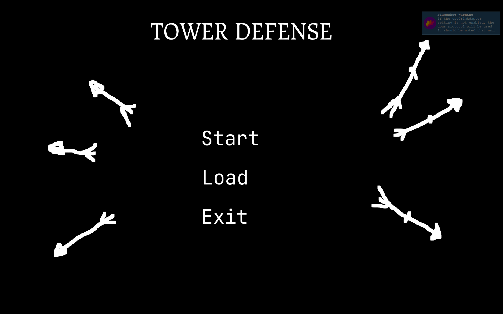
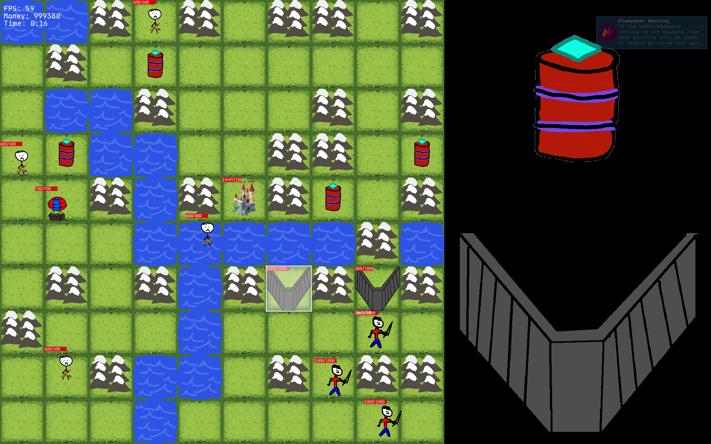

# Tower Defense

[](https://opensource.org/licenses/MIT)
[](https://isocpp.org/)
[](https://cmake.org/)

Продвинутая игра в жанре Tower Defense с гибкой архитектурой и глубокими возможностями конфигурирования. Проект разработан с соблюдением принципов SOLID и демонстрирует современные практики проектирования на C++20. Визуализация реализована с использованием библиотеки SFML.

## Обзор

Игра позволяет стратегически размещать оборонительные башни и применять способности на карте, чтобы не дать волнам врагов достичь замка. Главная особенность проекта — **максимальная гибкость**: практически любой параметр игры можно изменить через JSON-конфигурации без перекомпиляции кода. Игровые сущности создаются через шаблонные фабрики, что обеспечивает типобезопасность и лёгкую расширяемость новыми типами объектов.

## Ключевые особенности

### Декларативная конфигурация через JSON
Все игровые сущности (враги, башни, способности, стратегии атак) описываются в конфигурационных файлах. Это позволяет добавлять новый контент или модифицировать существующий без изменения исходного кода — достаточно отредактировать `.json` файл. Сборка через CMake не требует повторной компиляции при изменении конфигураций.

### Шаблонный контейнер Matrix
В проекте реализован собственный шаблонный класс `Matrix`, полностью удовлетворяющий требованиям стандартного контейнера C++. Контейнер поддерживает:
- Работу с элементами любого типа через шаблонный параметр
- Прямые и обратные итераторы (`iterator`, `const_iterator`, `reverse_iterator`)
- Доступ к элементам по индексу `(row, col)` с проверкой границ
- Итерацию по строкам и столбцам
- Совместимость со стандартными алгоритмами STL
- Семантику перемещения и копирования

Контейнер используется для представления игрового поля и карт уровней, обеспечивая эффективный доступ к ячейкам сетки.

### Шаблонные фабрики объектов
Создание игровых сущностей (врагов, башен, способностей) реализовано через обобщённые фабрики на шаблонах C++20. Это обеспечивает:
- Типобезопасность на этапе компиляции
- Автоматическую регистрацию новых типов
- Отсутствие необходимости изменять существующий код при добавлении новых сущностей (принцип Open/Closed)

### Паттерн "Стратегия" для системы атаки
Система атаки реализована через паттерн "Стратегия", что позволяет гибко добавлять новые типы атак. Реализованные стратегии:
- **Ближний бой**: атака юнитов в непосредственной близости
- **Дальний бой**: атака на расстоянии с настраиваемой дальностью

Добавление нового типа атаки (например, магической или площадной) сводится к реализации нового класса стратегии и её регистрации в конфигурации, не затрагивая существующий код.

### Гибкая система способностей
Способности полностью конфигурируемы через JSON и могут иметь комплексное поведение. Все параметры способностей, включая типы создаваемых юнитов и модификаторы характеристик, задаются в конфигурационных файлах. Реализованные способности:

- **"Сфера смерти" (On-Death Spawn)**: при гибели юнита на его месте появляется группа других юнитов. Например, павший шар порождает лучников. Тип и количество появляющихся юнитов настраивается в конфиге способности — можно легко заменить лучников на любых других существующих юнитов без правок кода.

- **Аура усиления**: юнит (например, босс) увеличивает характеристики урона, защиты и скорости всех союзников в заданном радиусе. Параметры атаки (радиус, множители для каждой характеристики) настраиваются в конфигурации. На основе этой механики реализован босс, усиливающий врагов поблизости.

- **Уклонение**: даёт юниту настраиваемый шанс полностью избежать входящей атаки. Вероятность уклонения задаётся в конфигурации.

### Расширяемая система передвижения врагов
Тип передвижения врагов (земля/воздух) задаётся через конфигурационный файл. При смене параметра враг меняет способ перемещения без каких-либо изменений в коде. Это позволяет легко создавать новые типы врагов, комбинируя различные характеристики передвижения с другими параметрами.

### Архитектурный паттерн MVP (Model-View-Presenter)
Проект построен с использованием паттерна MVP, который обеспечивает чёткое разделение ответственности:
- **Model**: данные и бизнес-логика (сущности, экономика, конфигурации)
- **View**: отображение игры через SFML
- **Presenter**: связующее звено, обрабатывающее пользовательский ввод и обновляющее Model и View

Такое разделение упрощает тестирование (Presenter можно тестировать с mock-объектами View и Model) и позволяет при необходимости заменить графическую библиотеку, не затрагивая игровую логику.Система сохранения через JSON

При выходе из игры всё состояние игрового мира автоматически сохраняется в JSON-файл. Сохраняются позиции башен, текущее здоровье замка, количество ресурсов, прогресс волн врагов и все остальные параметры, необходимые для полного восстановления игровой сессии. При следующем запуске игрок может загрузить сохранение через главное меню и продолжить с того же места. Формат сохранения также основан на JSON, что делает файлы сохранений человекочитаемыми и при необходимости позволяет редактировать их вручную.
Система сохранения через JSON

При выходе из игры всё состояние игрового мира автоматически сохраняется в JSON-файл. Сохраняются позиции башен, текущее здоровье замка, количество ресурсов, прогресс волн врагов и все остальные параметры, необходимые для полного восстановления игровой сессии. При следующем запуске игрок может загрузить сохранение через главное меню и продолжить с того же места. Формат сохранения также основан на JSON, что делает файлы сохранений человекочитаемыми и при необходимости позволяет редактировать их вручную.
### Соблюдение принципов SOLIDСистема сохранения через JSON

При выходе из игры всё состояние игрового мира автоматически сохраняется в JSON-файл. Сохраняются позиции башен, текущее здоровье замка, количество ресурсов, прогресс волн врагов и все остальные параметры, необходимые для полного восстановления игровой сессии. При следующем запуске игрок может загрузить сохранение через главное меню и продолжить с того же места. Формат сохранения также основан на JSON, что делает файлы сохранений человекочитаемыми и при необходимости позволяет редактировать их вручную.
Архитектура проекта построена в соответствии с пятью принципами SOLID:
- **SRP (Single Responsibility)**: каждый модуль имеет одну причину для изменения (враги, башни, способности, экономика разделены)
- **OCP (Open/Closed)**: сущности открыты для расширения через конфигурации и новые классы, но закрыты для модификации существующего кода
- **LSP (Liskov Substitution)**: базовые классы могут быть заменены наследниками без нарушения работы программы
- **ISP (Interface Segregation)**: интерфейсы разделены на узкоспециализированные
- **DIP (Dependency Inversion)**: модули зависят от абстракций, а не от конкретных реализаций
## Скриншоты

### Главное меню


### Игровой процесс

## Технологический стек

| Категория | Технология |
|-----------|------------|
| Язык программирования | C++20 |
| Графическая библиотека | SFML3 |
| Система сборки | CMake 3.15+ |
| Конфигурации | JSON |
| Документирование | Doxygen |
| Лицензия | MIT |
Система сохранения через JSON

При выходе из игры всё состояние игрового мира автоматически сохраняется в JSON-файл. 
Сохраняются позиции башен, текущее здоровье замка, количество ресурсов, прогресс волн врагов и все остальные параметры, необходимые для полного восстановления игровой сессии. 
При следующем запуске игрок может загрузить сохранение через главное меню и продолжить с того же места. Формат сохранения также основан на JSON, что делает файлы сохранений человекочитаемыми и при необходимости позволяет редактировать их вручную.
Пример конфигурации

Добавление новой способности сводится к описанию в JSON-файле. Например, способность "сфера смерти", которая при гибели юнита создаёт группу других юнитов:
json

{
  "ability_id": "death_sphere",
  "type": "on_death_spawn",
  "trigger": "unit_destroyed",
  "params": {
    "spawn_unit": "archer",
    "spawn_count": 3,
    "spawn_radius": 50.0
  }
}

Аналогичным образом описываются враги, башни, стратегии атак и все остальные игровые сущности. Вся игра конфигурируется без перекомпиляции — достаточно изменить параметры в JSON-файле и перезапустить приложение.
## Компонент Matrix

Шаблонный класс `Matrix` представляет собой двухмерный контейнер, полностью соответствующий требованиям стандартного контейнера C++. Он используется для представления игрового поля, карт уровней и сетки размещения объектов.

**Возможности контейнера:**
- Хранение элементов произвольного типа `T`
- Доступ по индексам строки и столбца `(row, col)`
- Итераторы: `iterator`, `const_iterator`, `reverse_iterator`, `const_reverse_iterator`
- Методы `begin()`, `end()`, `cbegin()`, `cend()`, `rbegin()`, `rend()`
- Совместимость со стандартными алгоритмами (STL)
- range-based for loop
- Семантика копирования и перемещения
- Методы получения размеров: `rows()`, `cols()`, `size()`

**Пример использования:**
```cpp
Matrix<int> field(10, 10);  // Создание поля 10x10

field(3, 5) = 42;           // Установка значения

for (const auto& cell : field) {
    // Обход всех ячеек через итераторы
}

// Использование со стандартными алгоритмами
auto it = std::find(field.begin(), field.end(), 42);
